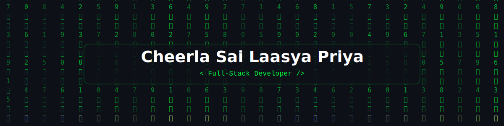

<!-- Animated Matrix Banner -->

  

 

 

<!-- Divider -->

<!-- ═══════════════════════════════════════════════════════ -->
<!-- ABOUT ME                                                  -->
<!-- ═══════════════════════════════════════════════════════ -->

## About Me

  

Full-Stack Developer passionate about building beautiful, scalable, and user-friendly web applications. I design and ship complete products end to end — from responsive React interfaces to robust Node.js, Python, and Java backends — with an emphasis on clean architecture and maintainable code.

- Building production-grade projects that **solve real problems**
- Committed to **clean code**, thoughtful UX, and modern architecture
- Driven by **scalable, well-structured systems** that grow gracefully
- Sharing knowledge through teaching and writing as I keep learning
- Fun fact: I debug better with **good music** playing

 

<!-- Divider -->

<!-- ═══════════════════════════════════════════════════════ -->
<!-- TECH STACK                                                -->
<!-- ═══════════════════════════════════════════════════════ -->

## Tech Stack

#### ✦ Frontend

  

#### ✦ Backend

  

#### ✦ Database & Tools

 

<!-- Divider -->

<!-- ═══════════════════════════════════════════════════════ -->
<!-- GITHUB STATS                                              -->
<!-- ═══════════════════════════════════════════════════════ -->

## GitHub Analytics

  
  

 

  

 

<!-- Activity Graph -->

  

<!-- Divider -->

<!-- ═══════════════════════════════════════════════════════ -->
<!-- ACHIEVEMENTS                                              -->
<!-- ═══════════════════════════════════════════════════════ -->

## Achievements

 

| Achievement | Description |
|:---|:---|
| **Pull Shark** | Opened pull requests that have been merged |
| **Quickdraw** | Closed an issue / PR within 5 min of opening |
| **Pair Extraordinaire** | Co-authored pull requests that got merged |
| **YOLO** | Merged a pull request without a code review |

<!-- Divider -->

<!-- ═══════════════════════════════════════════════════════ -->
<!-- CONNECT                                                   -->
<!-- ═══════════════════════════════════════════════════════ -->

## Connect With Me

<!-- Divider -->

 

⭐ **If you find my work helpful, consider starring my repos!** ⭐

 

